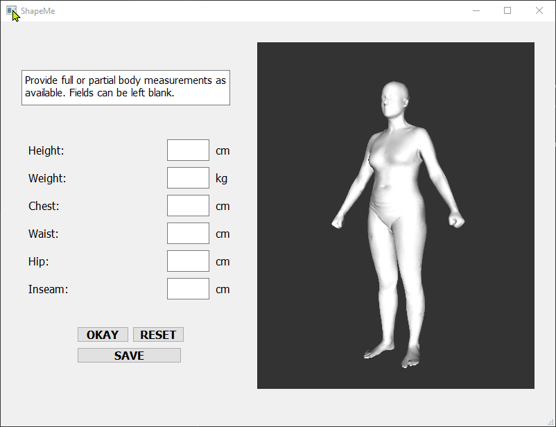

# ShapeMe: Custom 3D Avatars from Your Body Measurements, with OBJ Export

ShapeMe is a desktop application (distributed as an .exe) that lets you generate a custom 3D avatar based on one or more body measurements. The app reshapes a parametric body model in real time and allows you to export the result directly as an .obj file for use in 3D software, visualization, or apparel design workflows. It was developed in Python using PyQt5 and PyOpenGL.

This project was adapted from [3D Human Body Reshaping with Anthropometric Modeling](https://github.com/zengyh1900/3D-Human-Body-Shape?tab=readme-ov-file) by Yanhong Zeng, Jianlong Fu, Hongyang Chao. The approach for estimating body measurements was based on their work, and portions of their open-sourced codebase were used. Training data come from [SPRING](https://graphics.soe.ucsc.edu/data/BodyModels/index.html), with 1,500 female meshes used for training.

## Demo

## Releases & Download
[Download ShapeMe (Windows .exe)](https://drive.google.com/file/d/1Z1C5BGXOrTVzLMBpBD-qnWg5MW6_UYWN/view?usp=sharing)

Download the ZIP file from the Google Drive link above. Then, go to the dist folder and double-click shapeme.exe to run the application. 
Note: the dist folder and the release_model folder must be in the same directory.

## Code Availability

The full codebase is currently private, as this project is being used in ongoing academic research. However, this repository provides the Windows .exe application to support users who need to generate and export .obj avatars. If you have questions about the implementation, please feel free to open an issue or contact me directly.

